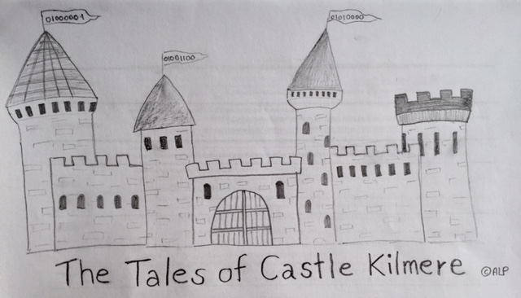

# My magical universe: "The Tales of Castle Kilmere"

The main character of our magical universe is named Cleon Bery. Cleon's parents died shortly after his birth, while fighting Lord Odon (a dark wizard with the ambition to control the magical world) and his Dark Army. Being an orphan, Cleon is raised by the Spinsters - a foster family living in Littleport, a village located in Cambridgeshire, UK. Although the Spinsters have a son in Cleon's age (Gary) the two don't get along very well. Gary always considered Cleon a threat to his status as an only child. As a consequence, Gary never misses an opportunity to bully Cleon and make him feel unwelcome.

At the age of ten, Cleon learns that he is not a normal child but blessed with the gift of magical powers. He gets invited to join Caste Kilmere - one of the world's best schools for magic. As Cleon learns later on, his parents went to Castle Kilmere themselves and enrolled him on the day of his birth.

On his first day at school, Cleon gets to know his future best friends - Flynn Gibbs and Cassidy Ambergem. While Flynn was raised in a wizard's home with loving parents and a bunch of siblings, including a younger sister (Aurora) and 5 older brothers (Henry, Jack, Alfie, Callum and Peter), Cassidy was raised with only one younger sister and non-magical parents. The three of them quickly learn that not all kids at school are nice. Especially Adrien Fulford and his brothers Raven and Seth give their best to make the lives of others miserable. Their father, Keres Fulford, was accused of being a member of the dark army several times and already spent a few years at prison for torturing non-magical people for pleasure.

Like many British schools, Castle Kilmere is divided into different Houses, 5 in total: the House of Courage, the House of Wisdom, the House of Loyalty, the House of Ambition and the House of Creativity. While Cleon and his friends end up in the House of Courage, Keres gets assigned to the House of Ambition (the House his brothers and many of the other mean kids belong to). Each House is supervised by a professor:
- Miranda Mirren, being strict and stiff, is the head of the House of Courage and teaches the subject of transfiguration
- Blade Bardock, the head of the House of Ambition is a grumpy and nasty guy. He teaches potions and usually treats students from other houses both unfriendly and unfairly 
- Birdie Briddle, a chubby, lovable old lady, is head of the House of Loyalty. She teaches the art of spell casting.
- Rupert Radford leads the House of Creativity and teaches the subject of art.
- And last but not least Gabriel Giddings, the teacher of broomstick flying and head of the House of Wisdom.

<!-- ## Andere Information -->
<!-- School headmaster: Redmond Dalodore -->
<!-- Subjects: charms, potions, broomstick flying, magical theory, foreign magical systems, history of magic, herbology, art -->
<!-- Ghosts: The mocking knight, the old lady, the gray groom -->
<!-- Tollpatschiger Schueler: Quintus Dukes -->
<!-- Ordinary Wizarding Levels (OWL's): Elementary levels of magic (ELM's) -->
 
 <!--        self._elms = { -->
 <!--                  'Broomstick Flying': False, -->
 <!--                  'Art': False, -->
 <!--                  'Magical Theory': False, -->
 <!--                  'Foreign Magical Systems': False, -->
 <!--                  'Charms': False, -->
 <!--                  'Defence Against Dark Magic': False, -->
 <!--                  'Divination': False, -->
 <!--                  'Herbology': False, -->
 <!--                  'History of Magic': False, -->
 <!--                  'Potions': False, -->
 <!--                  'Transfiguration': False} -->
